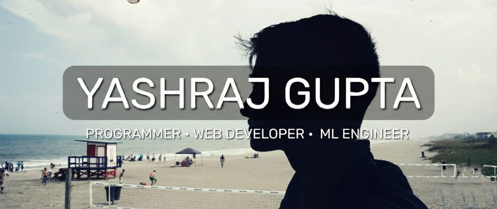

<!-- 

  

 -->

  

<h2>
  
  Hey there! I'm Yash
</h2>

## 👨🏻‍💻 About Me

- 💡 Competitive Programmer and Full-Stack Developer focused on problem-solving and building reliable systems.
- 🎓 3rd-year B.Tech CSE (AI) student at KIET Group of Institutions.
- 🧠 Actively working on DSA, competitive programming, and full-stack development; exploring ML practically.
- ♟️ Interested in chess and psychology, influencing my approach to strategy and decision-making.
- 🤝 Open to relevant internship opportunities and technical collaborations.
- ✉️ You can shoot me an email at yashrajgupta188@gmail.com! I'll try to respond as soon as I can.
- 📄 Please have a look at my [resume](./BetterCallYash.pdf) for more details about me. I'm open to feedback and suggestions!

<h2>🛠 Tech Stack</h2>

  
  
  
  
  
  

  
  
  
  

  
  

  
  
  
  

 

## 📊 GitHub Analytics

## ⚔️ Competitive Programming

&nbsp;&nbsp;&nbsp;

&nbsp;&nbsp;&nbsp;

&nbsp;&nbsp;&nbsp;

## 🤝🏻 Connect with Me

&nbsp;&nbsp;&nbsp;

&nbsp;&nbsp;&nbsp;

&nbsp;&nbsp;&nbsp;

